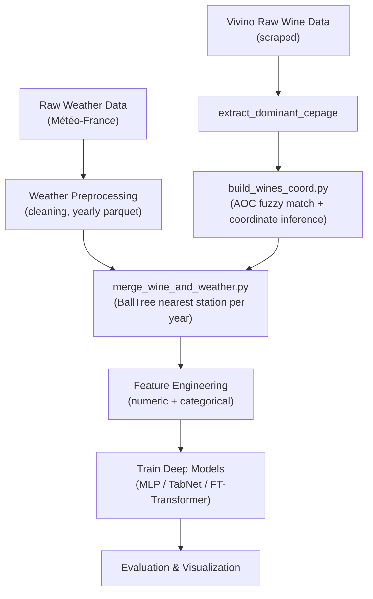

# DL-Wine: Predicting Wine Quality from Weather Patterns


This repository contains modular pipelines for predicting French wine quality from historical weather data.
The workflow combines:

- **Weather datasets** from Météo-France
- **Wine ratings** scraped from Vivino
- **Geographic AOC mapping and weather matching**
- **Deep learning models** (MLP, TabNet, FT-Transformer)  
  to anticipate vintage quality given yearly climate features.

---

## Pipeline Overview



The diagram reflects the actual code structure in `src/preprocessing`, `src/models`, and `src/visualization`.

---

## Repository Contents

- **Preprocessing pipelines**
  - `build_wines_coord.py`: AOC matching, centroid computation, coordinate correction
  - `merge_wine_weather.py`: merge Vivino ratings with nearest weather stations
  - `feature_engineering.py`: compute derived numeric and categorical indicators for models
- **Model training** (`src/models/`)
  - MLP, TabNet, and FT-Transformer architectures and training utilities
- **Visualization tools** (`src/visualization/`)
  - Plotly maps for geographic data
  - Metric and distribution plots
- **Scraper module** (`src/scrapper/`, under refactor)
  - Automated Vivino data extraction

---

## Installation

This project uses **uv** for dependency and environment management.

### 1. Install uv

```bash
pipx install uv
# or
pip install uv
```

### 2. Install dependencies

```bash
uv sync
```

Install dev tools (pytest, ruff, mypy, pre-commit):

```bash
uv sync --group dev
```

### 3. Optional: Set PYTHONPATH

```bash
# macOS/Linux
export PYTHONPATH=$(pwd)

# Windows PowerShell
$env:PYTHONPATH = (Get-Location).Path
```

---

## Data Overview

### Weather

Daily weather observations from [Météo-France](https://www.data.gouv.fr/datasets/donnees-climatologiques-de-base-quotidiennes/)
are organized by French department and span approximately 1950–2025.

Processed files by year are stored in:

```text
data/weather_by_year_cleaned/
```

(Intermediate folders such as `data/weather/` or `data/weather_by_year/` may also be present,
depending on your local preprocessing steps.)

### Wine

Vivino wine ratings and metadata (region, vintage, grape variety, rating) are stored in:

```text
data/Wine/
```

Regional coordinates are defined in:

```text
data/wine/regions.csv
```

Corrected region centroids, derived from Vivino data, are stored in:

```text
data/Wine/region_centroids_from_wines_corrected.csv
```

An interactive wine region map is published at:
[Wine map 🍷](https://lucasponcet.github.io/wine-quality-forecasting/wine_map.html)

---

## Quick Start

### 1. Generate Wine Coordinates (AOC + Centroids)

```bash
python -m src.preprocessing.build_wines_coord
```

This script:

- fuzzy-matches AOC polygons to Vivino regions,
- computes centroids in a metric CRS then reprojects to WGS84,
- applies manual centroid corrections,
- writes cleaned coordinates to `data/out/`.

### 2. Merge Vivino and Weather Data

```bash
python -m src.preprocessing.merge_wine_weather
```

This script:

- expands regions across years (e.g. 2010–2024),
- associates each region-year with the nearest weather station (within a distance threshold),
- merges Vivino wines on `(region, year)`,
- saves:

```text
data/out/vivino_wines_with_weather.csv
data/out/vivino_wines_with_weather.parquet
```

(The `feature_engineering` module is used programmatically by training code to add derived features
on top of these merged datasets.)

### 3. Inspect the Resulting Dataset

```python
import pandas as pd

wine = pd.read_csv("data/out/vivino_wines_with_weather.csv")
print(wine.head())
```

---

## Project Structure

```text
DL_Project/
├─ data/                         # Raw and processed datasets
│  ├─ weather_by_year_cleaned/   # Yearly cleaned weather files
│  ├─ Wine/                      # Vivino raw & corrected data
│  └─ out/                       # Outputs from preprocessing pipelines
├─ src/
│  ├─ models/
│  │   ├─ architectures/         # MLP, TabNet, FT-Transformer implementations
│  │   ├─ builders/              # Model-building helpers (e.g. TabNet, FTT)
│  │   ├─ training/              # Training pipelines (mlp_runner, tabnet_runner, ftt_runner, etc.)
│  │   └─ data/                  # Dataset loaders and modules
│  ├─ preprocessing/
│  │   ├─ build_wines_coord.py   # Build coordinates for wines (AOC matching + centroids)
│  │   ├─ merge_wine_weather.py  # Merge Vivino and weather by region/year
│  │   ├─ feature_engineering.py # Engineered features for tabular models
│  │   └─ utils/                 # Shared text, geo, feature & weather helpers
│  ├─ visualization/
│  │   ├─ plots/                 # Metrics plots, histograms, etc.
│  │   └─ maps/                  # Plotly maps (e.g. wine region map)
│  └─ scrapper/                  # Vivino scrapers (currently under refactor)
├─ scripts/                      # High-level experiment / baseline runners
├─ tests/                        # Pytest suite for all components
├─ models/                       # Trained model checkpoints
├─ pyproject.toml
└─ README.md
```

---

## Workflow

### Data Acquisition (Scraping)

Raw wine data is collected from **Vivino** using automated scrapers located in: `src/scraper/`.

Raw weather data can be collected from : [Météo-France](https://www.data.gouv.fr/datasets/donnees-climatologiques-de-base-quotidiennes/)

### Data Preprocessing

1. **Weather cleaning (upstream / one-off)**  
   Prepare yearly cleaned weather files in `data/weather_by_year_cleaned/`.

2. **Build wine coordinates**

   ```bash
   python -m src.preprocessing.build_wines_coord
   ```

3. **Merge wines with weather**

   ```bash
   python -m src.preprocessing.merge_wine_weather
   ```

4. **Feature engineering (in-code)**
   - `src/preprocessing/feature_engineering.py` and
   - `src/preprocessing/utils/feature_utils.py`  
     define derived numeric and categorical indicators.  
     These are used directly by training pipelines (e.g. TabNet and FT-Transformer runners).

### Model Training and Evaluation

Model-specific training pipelines live under `src/models/training/` and are exercised by the test suite.
Example high-level runners (depending on your experiment setup):

```bash
# Baseline training / comparison
python -m scripts.run_baselines.py

# MLP model
python -m scripts.run_mlp.py
```

Trained weights are stored under `models/` and evaluation plots under `data/out/` and `src/visualization/` outputs.

---

## Technical Report

The project is documented in a LaTeX report, which details:

- Data collection and preprocessing design
- Modeling choices (architectures, loss functions, evaluation protocol)
- Experiments and results (metrics, ablations)
- Limitations and future work

```text
docs/
└─ report/
   └─ wine_quality_report.pdf    # Compiled report
```

```markdown
For full methodological details, see the [technical report](https://lucasponcet.github.io/report/wine_quality_report.pdf).
```

---

## Testing

A comprehensive pytest suite covers:

- Preprocessing utilities (`text_utils`, `geo_utils`, `weather_utils`, feature engineering)
- Model components (architectures, builders, trainers)
- End-to-end runners (e.g. TabNet/FTT/MLP pipelines)
- Script entrypoints (`scripts/run_baselines.py`, `scripts/search_optuna.py`, etc.)

Run all tests with:

```bash
pytest
```

---

## Contributing

Contributions are welcome. To propose changes:

1. Fork the repository
2. Create your feature branch:
   ```bash
   git checkout -b feature/new-analysis
   ```
3. Commit your changes:
   ```bash
   git commit -m "Add new analysis"
   ```
4. Push your branch:
   ```bash
   git push origin feature/new-analysis
   ```
5. Open a Pull Request

---

## License

This project is licensed under the MIT License.  
See the `LICENSE` file for details.

---

This repository is intended to be self-contained and reproducible, so that reviewers can:

- Understand the data pipeline end-to-end,
- Re-run preprocessing and training with a few commands,
- Inspect both the code and the accompanying technical report.
